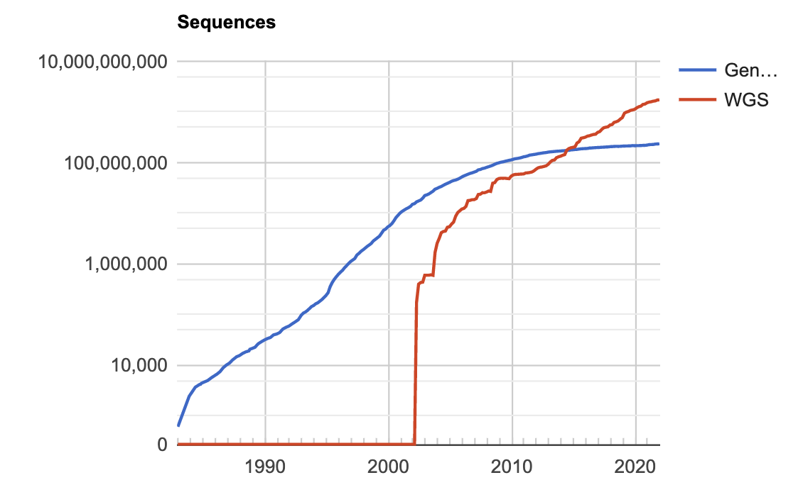
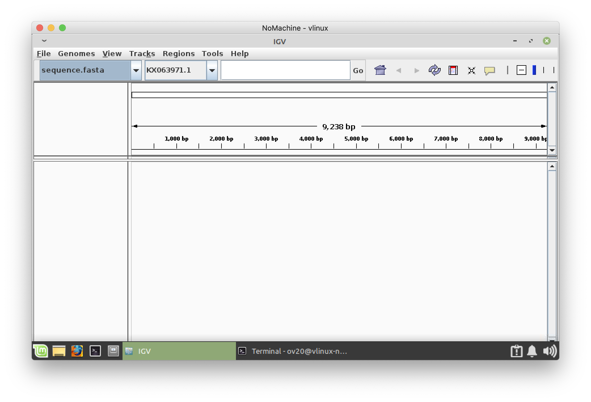
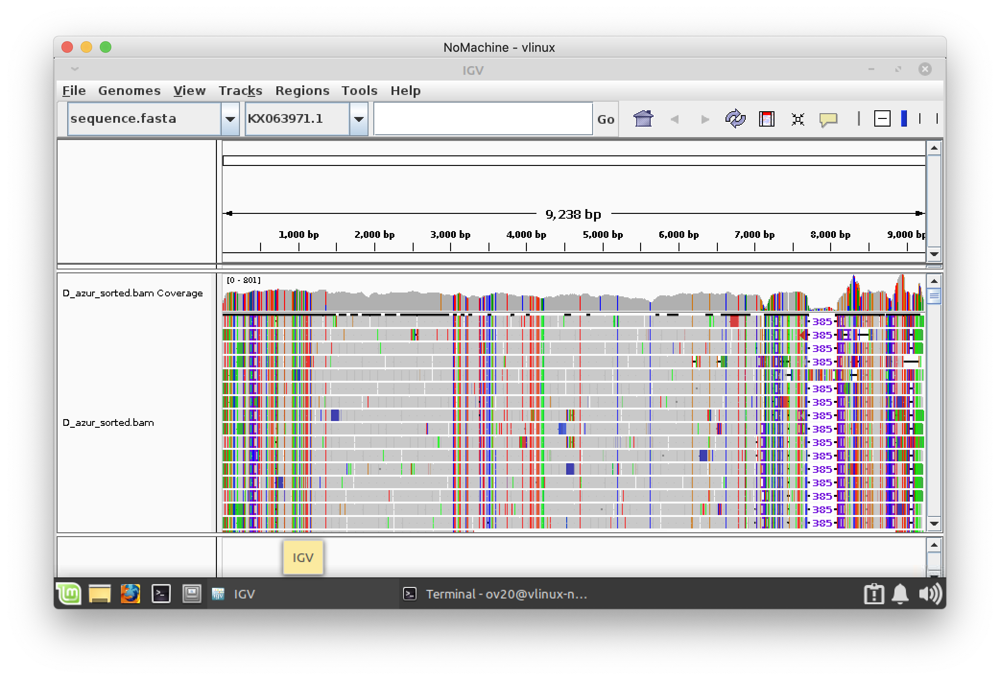

# Week three

> Add the flag to the corner of your screen 

To start this tutorial you need to be logged in the Linux virtual machine
[vlinux.humboldt.edu](https://vlinux.humboldt.edu/)

Once logged in the Linux machine, look for the Terminal, it is an icon that contains the characters `>\_`

You can also write `terminal` in the search bar of the main manu located in the left bottom of the operating system.

## Mapping reads to a reference

Now that we have been able to run programs on data files containing reads, cleaning and trimming these reads. It is time to assemble these reads into actual DNA sequences.

### Download data


First, let's download the data needed for today's exercise.

```
cd Documents
mkdir week_03
cd week_03
wget https://github.com/oscarvargash/biol_550_2024/raw/main/week_03/files/files_w3u.zip
```

Let's unzip the data 

```
unzip files_w3.zip
```

> Remove your flag if you are good to continue 

### Download reference

GenBank is a repository of DNA sequences, it contains (in theory) sequences for every single pusblished study that has use DNA.



> Add the flag to the corner of your screen 

We will download our reference from GenBank. Our data is a subset of genomic reads that correspond the nuclear ribosomal RNA. Inside your virtual linux go to:

[https://www.ncbi.nlm.nih.gov/genbank/](https://www.ncbi.nlm.nih.gov/genbank/)


In the search bar type:

```
Diplostephium haenkei internal transcribed spacer
```

Click on the first result. This page shows the sequence in GenBank format. A useful format for mapping is the fasta format. To download the seqeuence in fasta format do the following.

1. Click on `send to` at the top right
2. Select the `file` option
3. Select the `fasta` format
4. Click on `create file`
5. Select `save file`
6. move the file to `week_03` from `Downloads`


How can we move `sequence.fasta` into `week_03` from `Downloads` in the terminal?

<details>
  <summary>Click to see an answer!</summary>
  
In the terminal, while located in `week_03` you can type:

```
mv ~/Downloads/sequence.fasta .
```

</details>

> Remove your flag if you are good to continue 

### Performing the mapping

> Add the flag to the corner of your screen 


First we need to create a reference. This step creates a database for bbmap of the reference.

```
bbmap.sh ref=sequence.fasta
```

Now we can do the mapping, note that our input is the two read files and our output is a `*.sam` file. This command also creates a script than later creates a `*.bam` file which, we will use to vizulize the mapping

```
bbwrap.sh in1=Diplostephium_azureum_R1_nrmap.fastq.gz in2=Diplostephium_azureum_R2_nrmap.fastq.gz outm=D_azur.sam append ref=sequence.fasta nodisk bamscript=bs.sh

ls 
```

Now let's create the bam file:

```
sh bs.sh
```

> Remove your flag if you are good to continue 


### Vizualizing the mapping (bam file)

> Add the flag to the corner of your screen 


We can vizualize the mapping by using the Integrative Genomics Viewer. Open the application by:

```
igv.sh
```

Load the reference sequence:

1. Click on `Genomes`
2. Click on `Load Genome from File`
3. Load `sequence.fasta` from your folder in `week_03`

You should be able to see the loaded reference of 9,238 base pairs



Load the mapping file `D_azur_sorted.bam`

1. Click on `file`
2. Click on `Load from File`
3. Load `D_azur_sorted.bam`

You should be able to see the mapping now



> Remove your flag if you are good to continue 


### Exercise

Navigate the mapping in IGV and answer the following questions:

1. Do the reads match exactly the reference?
2. Identify at least two problematic regions, indicate their coordinates (in base pairs) and why you think these are problematic.

