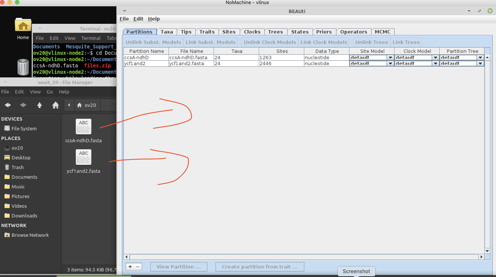
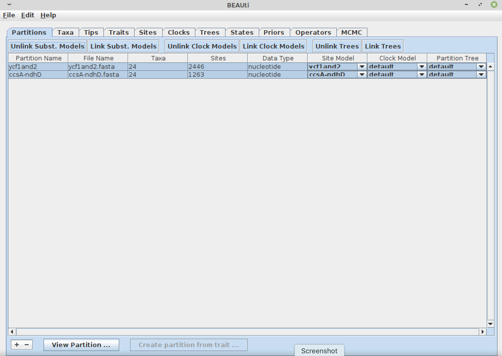
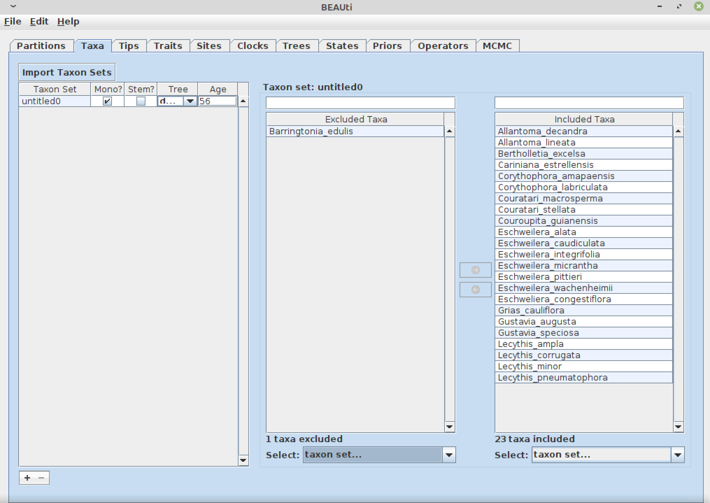
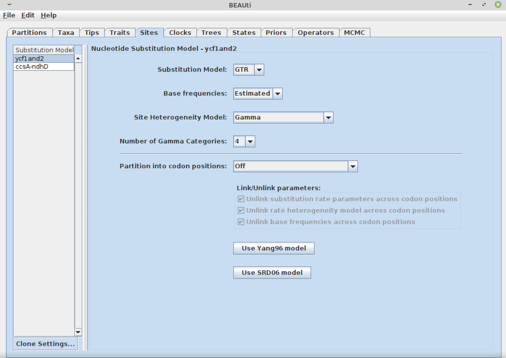
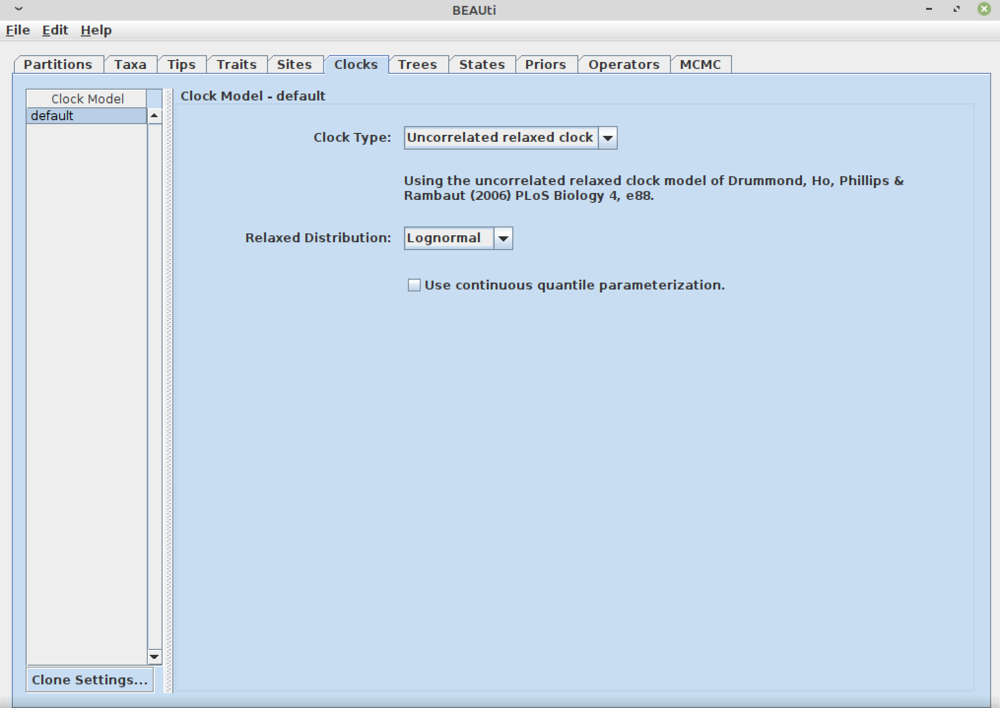
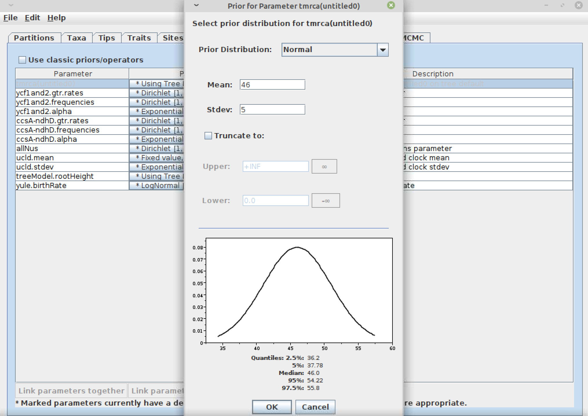

# Week nine: creating scripts; calibrating a phylogeny

To start this tutorial you need to be logged in the Linux virtual machine
[vlinux.humboldt.edu](https://vlinux.humboldt.edu/)

Once logged in the Linux machine, look for the Terminal, it is an icon that contains the characters `>\_`

You can also write `terminal` in the search bar of the main manu located in the left bottom of the operating system.

## Creating a script to get our files ready for analysis

> Add the flag to corner of your screen 

One of the advantages of using the terminal is that you can save commands into a text file for re-execution later (saving scripts also helps with keeping a record of your methods for writing these into your dissertation and/or scientific paper). We will write a small script to get our computer ready for today's exercise:

1. Create a new text file using nano in your home directory:
```
cd ~
nano week9.sh
```
The `.sh` suffix indicates that this script is to be excuted on shell (which is the terminal of Linux)

2. Add ALL the commands to be used in your script, copy and paste the text below into nano:

```
# quick sript to get ready for the lab of week 9
cd Documents
mkdir week_09
cd week_09
wget https://github.com/oscarvargash/biol_550_2022/raw/main/week_09/files/files.zip
unzip files.zip

```
Notice how there is an "enter" at the end of the sript, this is to ensure the last line is executed by the shell. Also notice that lines that start with `#` are not interpreted as commands, these are comments that you can add to your script to expmain it.

3. Save the file while closing nano:
<kbd>control</kbd> + <kbd>x</kbd>

Then answer:
<kbd>y</kbd>

Finally press:
<kbd>return</kbd>

4. Make the script excutable. When you list the details of your files `ls -l` you will see that your file is not executable yet. You can change this:

```
chmod +x week9.sh
```

5. Execute your script:
```
./week9.sh
```

Congrats!! You have created and executed an script. You can check that eveything is fine by navigating to week 9:

```
cd Documents/week_09
ls
```

> Remove your flag if you are good to continue 

## Building a Chronogram

### Preparing an analysis file using Beauti

> Add the flag to corner of your screen 

In order to perform a Bayesian analysis with Beast we need to create a `.xml` file that contains all the information necessary for the analysis. Open Beauti:

```
beauti
```

You will see a window:

1. Drag and drop both fasta files

2. Unlink the substitition models by clicking on <kbd>Unlink Subst. Models</kbd> while having both regions being selected

3. Move to the <kbd>Taxa</kbd> tab and create a taxon set by clicking on <kbd>+</kbd>. Include all the taxa with the exception of Barringtonia. Make this group mononophyletic and add the age of 46. This is the node that will be calibrated to add time to the phylogeny.

4. Move to the <kbd>Sites</kbd> tab

5. Select <kbd>GTR</kbd> and <kbd>Gamma</kbd> for each partition
6. Move to the <kbd>Clocks</kbd> tab and select a <kbd>Uncorrelated relaxed clock</kbd>, this models assumes that your tree branches are heterogeneous, a common pattern in most topologies.

7. Move to the <kbd>Trees</kbd> tab and select a <kbd>Speciation: Yule model</kbd>, this is a simple model of speciation that assumens no significant chages of speciation rate along your tree.
8. Move to the <kbd>Piors</kbd> tab, click on <kbd>* Using Tree Prior</kbd> in front of `tmrca(untitled0)`; this is the prior for the age of the most recent common ancestor for the taxon set we created in step 3. Because this age was inferred from another publication (secondary calibration), we will use a <kbd>Normal</kbd> distribution with a mean of 46 and standard deviation of 5, which roughly correspond to the same interval found in the paper we are using for this calibration.

9. Go to the <kbd>MCMC</kbd> tab and change the file name stem to: `two_cp_g`. You can see that in this tab you can change all parameters for the MCMC chain.
10. File go to <kbd>file</kbd> and select <kbd>Generate Beast File</kbd>. Save your file in the week_09 folder.

> Remove your flag if you are good to continue 

### Runing beast

> Add the flag to corner of your screen 

You can open beast and run the file we just created. However, we will run this analysis in the CIPRES portal. This is an excelent and free resource to access high computational power for large datasets.

1. Create an account in https://www.phylo.org/
2. Create a new folder `Lecy`
3. Upload the file `two_cp_g.xml` to the subfolder `data`, you can add the label `two_cp_g`
4. Go to <kbd>Tasks</kbd> and crate a new task
5. Add `beast cp` as the description, and select as the <kbd>Imput data</kbd> the `two_cp_g.xml` that you uploaded in the previous step.
6. In the <kbd>Select tool</kbd> tab, select the `BEAST2 (current)`
7. Click on parameters and change the maximum numbers of hours to run to `12`
8. Finally click <kbd>Save and run</kbd> to run the task 
9. You can check the status of the job in the <kbd>Tasks</kbd>
10. Download results when analysis has finished

> Remove your flag if you are good to continue 

### Calculating a chronogram

> Add the flag to corner of your screen 

To avoid the wait, we will dowload the results from an analysis previously ran:

```
wget https://github.com/oscarvargash/biol_550_2022/raw/main/week_09/files/files2.zip
unzip files2.zip
```

Open tracer and load the `*.log` file

```
tracer
```
Does it look like a good analysis?

Look at the `stdout.txt` file in a text editor.

Finally, assuming our analysis is good, we can produce a maximum credibility tree:

```
treeannotator
```

Load the tree file `two_cp_g.trees` as the <kbd>Imput tree file</kbd> using a <kbd>Burnin</kbd> of `5000` trees that correspond to 50%. Name the output `chrono.tre`

```
figtree chrono.tre
```

In figtree show the `scale axis` as `reverse axis`. Also add `node bars` displaying the `height_95_HPD`

Congrats you have crated your first chronogram!


> Remove your flag if you are good to continue 

