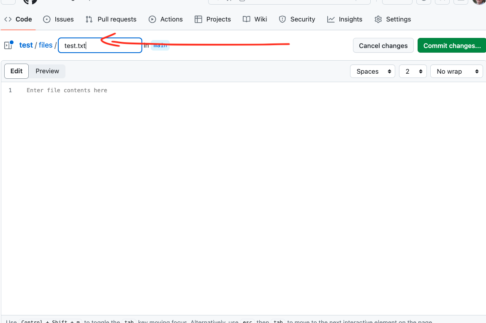

# Week ten: coalescent analysis using Astral

To start this tutorial you need to be logged in the Linux virtual machine
[vlinux.humboldt.edu](https://vlinux.humboldt.edu/)

Once logged in the Linux machine, look for the Terminal, it is an icon that contains the characters `>\_`

You can also write `terminal` in the search bar of the main manu located in the left bottom of the operating system.

## creating a coalescent-consistent tree

> Add the flag to corner of your screen 

Let's download the data needed for this week's tutorial

```
cd Documents
mkdir week_10
cd week_10
wget https://github.com/oscarvargash/biol_550_2024/raw/main/week_10/files/files.zip
unzip files.zip
```

### Inferring gene trees

We first need to infer gene trees for each on the genes in the downloaded data. Notice that we will use GTR+G to save some time from model testing.

```
for file in *.aln-cln; do iqtree -bb 1000 -s $file -m GTR+G; done
```

Let's take a look at one tree:

```
cat AT5G37830.names.fa.aln-cln.treefile
```

> Remove your flag if you are good to continue 

### Building a coalescent consistent species tree

> Add the flag to corner of your screen 

The first step for using Astral-pro3 is to create a single file that contains all the trees. To create a single tree we can use `cat` and a wildcards in the following way:

```
cat *cln.treefile > nc_20g.tre
```

Let's check that the concatenation of tree files worked:

```
cat nc_20g.tre
```

We can now run Astral-pro3:

```
/astral-pro3 -i nc_20g.tre -o nc_astral.tre
```

We can now see the tree in fig tree:

```
figtree nc_astral.tre
```

> Remove your flag if you are good to continue 


## Adding images and files to your github project

> Add the flag to corner of your screen 

We will create a image file from our recently obtained tree and will uploaded to github. To save an image of your tree do the following:

1. Format the tree the best you can, reroot the tree using _Barringtonia_, ladderize the tree (<kbd>trees</kbd>; <kbd>order nodes</kbd>), show the support (<kbd>node labels</kbd>), and adjust the font (<kbd>tip labels</kbd>).

2. Then do <kbd>file</kbd> and <kbd>export jpg</kbd>.

3. Save the file in your `week_10` folder.

> Remove your flag if you are good to continue 

### Uploading files to github and referencing them in the text

Go to your GitHub project you created [previously](https://github.com/oscarvargash/biol_550_2024/tree/main/week_05#github) 

Once you are there click on the <kbd>+</kbd> buttom in the top right and select the option <kbd>create new file</kbd> 


Then type `files/test.txt` this will create a folder with a new file called test.txt. Click twice on <kbd>commit changes</kbd> 


This file is just a placeholder file we have created so we could create the `files` folder.

Now click on <kbd>+</kbd> and then <kbd>upload file</kbd>, upload `nc_astral.tre.jpg` and <kbd>commit changes</kbd> 

Your file is now in GitHub. This is the way you should upload your data to your repository.

Since this file is an image we can also add this image to your `readme.MD` file in your main page. Simply clink on the <kbd>pencil</kbd>  for editing and add the following to the code to the line you want the image to display:

```

```

After <kbd>commit changes</kbd> the image should now be displayed in your project page.

> Remove your flag if you are good to continue 

### Exercise

1. Based on the chornogram, what is the most recent divergence in the tree? in other words, which species are the most recent to have diverged? Indicate their age and their confidence interval.

2. What is the age and the confidence interval for of _Bertholletia excelsa_?

