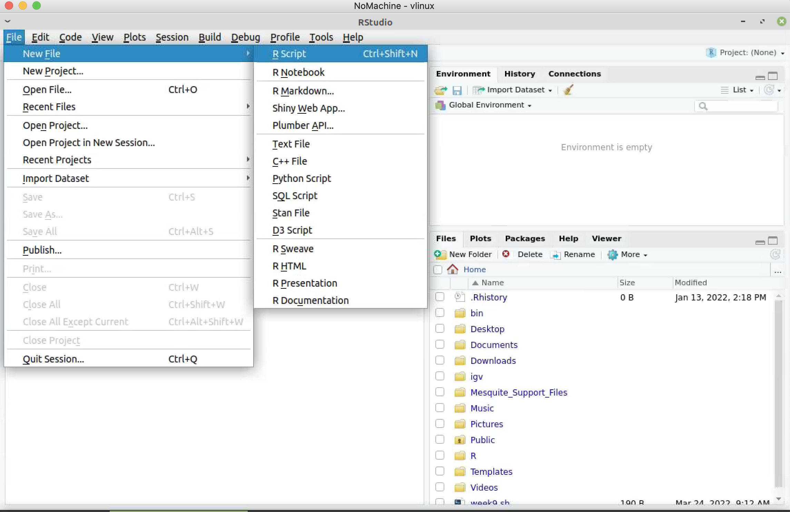
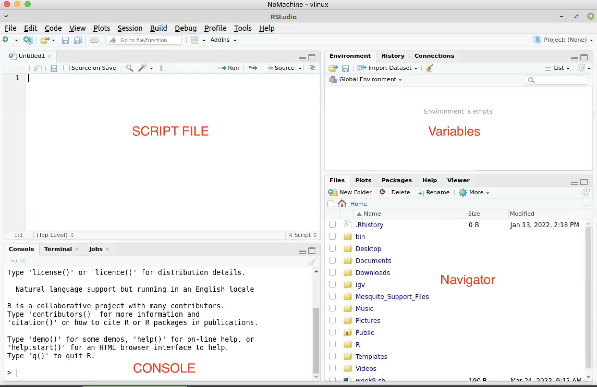
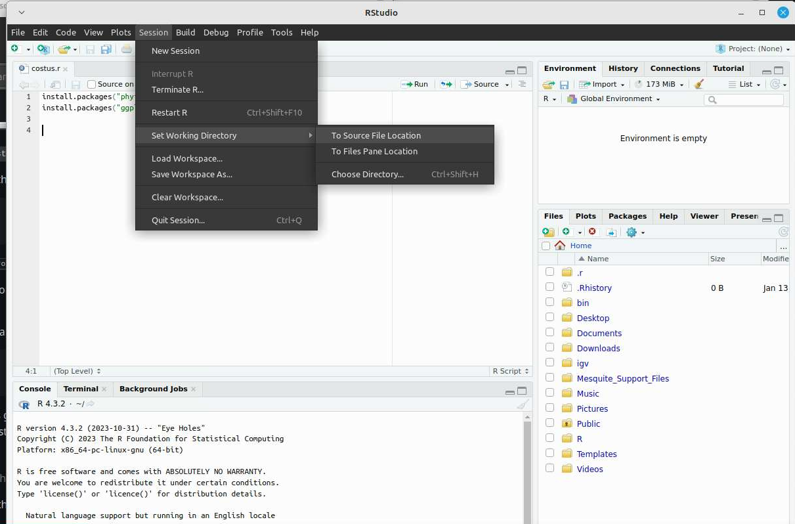

# Week eleven: using R to perform stochastic character mapping

To start this tutorial you need to be logged in your **Windows** machine in the classroom.

Alternatively you can log to the a virtual windows machine using: https://vlab.humboldt.edu

## Hyper-brief intro to R

R is coding language originally designed for statistics. With its increasing popularity among the scientific community, many R pakages have been developed to perform all kind of analyses, including comparative phylogenetic analyses.

We will use R and R-studio (which is a "facade" for R) to perform comparative phylogenetic analyses. 

> Add the flag to corner of your screen 

First crate a folder and download the data necessary for the exercise:

1. go to `Documents`
2. create a folder named `week_11`
3. Download the files from [GitHub](https://github.com/oscarvargash/biol_550_2024/raw/main/week_11/files/files.zip)
4. Transfer `files.zip` to `week_11`
5. Secondary click on `files.zip` to unzip the files on current folder using `extract to` (avoid creating a new folder inside week_11)

Now that we have the files necessary we can open Rstudio by simply typing `Rstudio` in the search bar of the OS.

Now, we need to create a new R script, this will save all the code we write, so we can easily execute the code later. Go to `file` and then click on `New File` and `R script`. Save the file in `week_11` with along with the other files.



We will write all our code in the script file:



Before you start writing code save your file as `costus.r` in the `week_11` folder.

First we will install all the necessary packages for the analysis:

```
install.packages("phytools")
install.packages("ggplot2")
```

Select the line of code and execute by typing <kbd>control</kbd> + <kbd>return</kbd>

You will see your console working on the installation, you only need to make the installation of pakages once (or every time you upgrade your version of R).

Now we need to set our working directory. This is a pivotal line of code for every project. An wasy way for setting up the working directory is to click on <kbd>session</kbd> then <kbd>set working directory</kbd> then <kbd>to source file location</kbd>. The previous action will create a single line of code that you can copy and paste into the script.



```
setwd("~/Documents/week_11")
dir()
```

`dir()` should print the contents of the folder. It is good practice to comment your code, so anyone can use it (including yourself in the future). You can add comments by starting a line with `#`

> If you see the files downloaded in the console change your flag to green 

Now we need to load the packages necessary for the analysis

> Add the flag to corner of your screen 

```
library(phytools)
library(ggplot2)
```
Now we are going to import the phylogentic tree and plot it

```
tree <- read.tree("chronogram_v8_2.no.rs.ld.tre")
plot(tree,cex=0.7, show.node.label=T)
```

Now we can import the data that contain the information for the tips

```
charaters <- read.csv("costus_pollination_v2.csv", row.names = 1)
```

You can click on the item `characters` to see what we have just imported. We only need the pollination information. So we will select this information as a matrix for our analysis:

```
poll <- as.matrix(charaters)[,2]
```

Now that we have the tree and the character states, we can simulate stochastic character maps on the phylogenetic tree. Then we will count the number of transitions and get a summary of the analysis

```
costus_trees <- make.simmap(tree,poll,model="ARD",nsim=1000)
transitions <- as.data.frame(countSimmap(costus_trees)) 
obj <- summary(costus_trees)
```

Now we can organize our data on transitions so we can create a comparative histogram

```
bee_2_humm <- as.data.frame(transitions$Tr.B.H)
names(bee_2_humm) = "n"
humm_2_bee <- as.data.frame(transitions$Tr.H.B)
names(humm_2_bee) = "n"
bee_2_humm$type <- 'bee_to_hummingbird'
humm_2_bee$type <- 'hummingbird_to_bee'
transitions2 <- rbind(bee_2_humm, humm_2_bee)
```
When `transitions2` is inspected you will see the simplicity of this data frame. We can now create a plot:

```
ggplot(transitions2, aes(n, fill=type)) + geom_histogram(binwidth=1)
ggsave("transitions.pdf", plot = last_plot())
```

Now we will create a figure that shows the evolution of the pollination onto the tree:

```
colors<-setNames(c("yellow","red"),colnames(obj$ace)) 

pdf(file="costus_pollination2.pdf",width=6,height=6,paper='special') 

plot(obj,ftype="i",lwd=1,fsize=0.6,ylim=c(-4,Ntip(tree)),
     cex=c(0.6,0.3),colors=colors)
add.simmap.legend(x=0,y=8,colors=colors,prompt=FALSE,
                  horizontal=FALSE,shape="circle",fsize=0.9)
axisPhylo()
dev.off()
```

Congratulations! you have performed your first stochastic character mapping
 

>  Remove your flag if you are good to continue 


