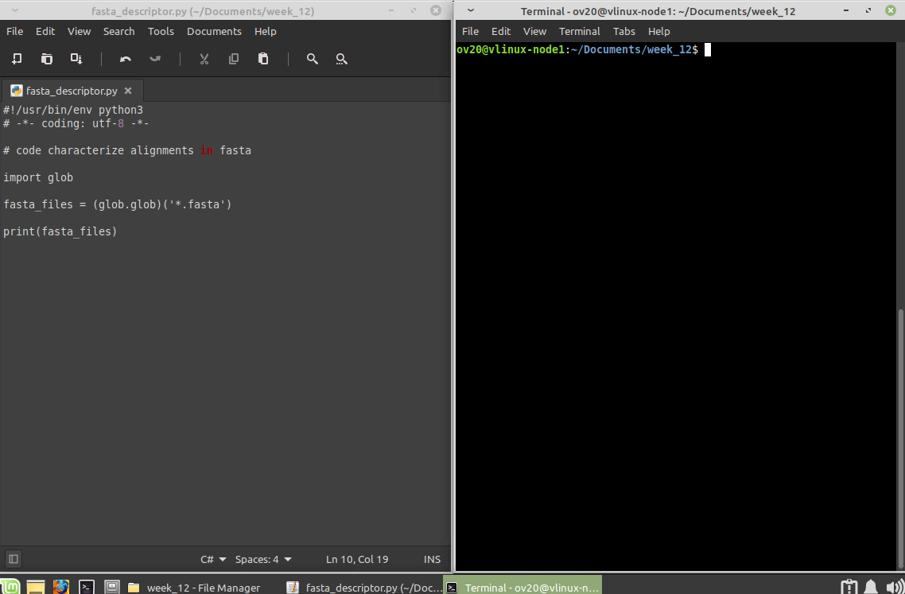

# Week twelve: introduction to python

To start this tutorial you need to be logged in the Linux virtual machine
[vlinux.humboldt.edu](https://vlinux.humboldt.edu/)

Once logged in the Linux machine, look for the Terminal, it is an icon that contains the characters `>\_`

You can also write `terminal` in the search bar of the main manu located in the left bottom of the operating system.

## Hyper-brief intro to python

Python is a coding language useful for writing medium-sized scientific projects with tons of data involved. Because python has many advantages for manipulating strings (text variables like DNA sequences), it is a useful programming language for phylogentics and DNA-related data analysis.


Like R, the engine that translates and runs Python is called the ***Python Interpreter*** and there are two ways to use it: 
- immediate/interactive mode: you type Python expressions into the Python Interpreter window, and the interpreter immediately shws the result.
- script mode:  where you'll write a program in a script and use the interpreter to execute the contents of the file. Scripts have the advantage that they can be saved to disk, printed, and so on.

> Add the flag to corner of your screen 

Let's download the files necessary for our exercise:

```
cd Documents
mkdir week_12
cd week_12
wget https://github.com/oscarvargash/biol_550_2022/raw/main/week_12/files/files.zip
unzip files.zip
```

### Using python interactively

There are two versions of Python, `python2` and `python3`. Because `python2` is being phased out we will learn `python3`. Differences between versions are minimal. 

***NOTE***: when using scripts from collaborators always check which version was used.

We can access the `python3` interpreter just by typing:

```
python3
```

Now we are in the Python interpreter, you'll notice that there's this **`>>>`**. This is called the Python prompt, in the same way we have the **`$`** when in `bash`. The interpreter uses the prompt to let you know that it is ready for instructions.

```
Python 3.6.9 (default, Mar 15 2022, 13:55:28) 
[GCC 8.4.0] on linux
Type "help", "copyright", "credits" or "license" for more information.
>>>
```

Let's start with the basics, enter `2 + 2` at the prompt to have Python do some simple math.

```
2 + 2
```
#### Types of variables in python

##### Integers

> Add the flag to corner of your screen 

We will assign the number 4 to the variable “bases”

```
bases = 4
type(bases)
```

We can check that bases was assigned by:

```
bases / 4
```

##### Floats

Float are numbers with decimals, while it seems silly to have two types of data, integers and float have different properties (these differences were more important in python2). In any case it is important to keep this in mind in case you get error messages associated with integers and floats.

```
rate = 0.1
type(rate)
```

We can now multiply our two variables :

```
rate * bases
```

Alternatively, we can assign the result to a new variable and then check its value. Because we are in the interpreter we can write the name of the variable and get its value. 

```
change = rate * bases
change
type(change)
```

##### Functions

We have been using `type()` to check the types of variables. We can also use the function `print()` to get the value of the variable:

```
print(change)
```

> Remove your flag if you are good to continue 

##### Strings

> Add the flag to corner of your screen 

A string is a singular piece of data stored as a single object. In bioinformatics, DNA sequences are an example of strings. Notice that strings have to be inside quotes

```
seq = 'atgctgctgtgtcg'
print(seq)
type(seq)
```

##### Operations on strings

We cannot perform mathematical operations with strings, even if they look like numbers. Some operators will be the same, but given that they data type is different, their function is different too. For example, to concatenate 2 strings (in our case sequences) we will use the `+` operator:

```
dobleseq=seq + seq
print(doubleseq)
```

##### Lists

Lists are useful to store ordered or unordered items. Notice that brackets surround the list, every item is separated by a comma, and non-numeric items are quoted

```
nuc = ['a','g','t','c']
```

A super-hyper-important thing in python is that items in list are indexed starting with 0. Meaning, that to invoke the first item of you need to do:

```
nuc[0]
```

Meanwhile, you can invoke the last item with:

```
nuc[3]
```

A cool trick to invoke the last item of list is: 

```
nuc[-1]
```

To exit `python` just type:

```
exit()
```
> Remove your flag if you are good to continue 

### Basic scripting

> Add the flag to corner of your screen 

One of the advantages of using python is that python can interact easily with bash.

Let's start a new script that will look into all fasta files in a folder to summarize their contents, let's create an empty text file:

```
touch fasta_descriptor.py
```

Now, le's open the file in a text editor, by navigating to it and opening it with the native text editor. It is nice to put the windows next to each other:

Just like in R, there are packages available in `python` for al sorts of operations. Packages are called using `import`

Let's copy and paste the following text into our script `fasta_descriptor.py`:

```
#!/usr/bin/env python3
# -*- coding: utf-8 -*-

# code characterize alignments in fasta

import glob

fasta_files = (glob.glob)('*.fasta')
print(fasta_files)


for file in fasta_files"
	print(file)
	char_len = len(file)
	print(char_len)

```




Save the file, and execute in the terminal:

```
python3 fasta_descriptor.py
```

Congratulations you have created your first `python3` script!

> Remove your flag if you are good to continue 


