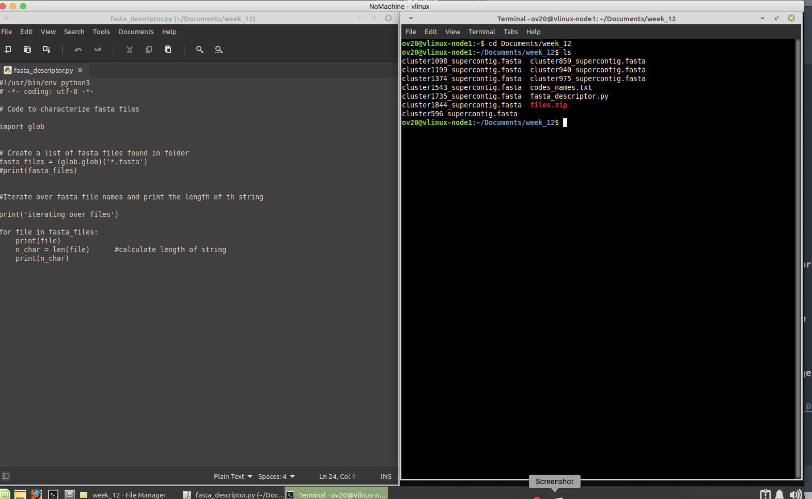

# Week thirteen: introduction to loops in python

To start this tutorial you need to be logged in the Linux virtual machine
[vlinux.humboldt.edu](https://vlinux.humboldt.edu/)

Once logged in the Linux machine, look for the Terminal, it is an icon that contains the characters `>\_`

You can also write `terminal` in the search bar of the main manu located in the left bottom of the operating system.

## Inspecting fasta-alignment files for length and number of sequences 

> Add the flag to corner of your screen 

We will continue working on the script file from week 12. Open a terminal and navigate to `week-12` folder

```
cd Documents/week_12
```

<details>
  <summary>If you need to download the data again please click here</summary>
  
```
cd Documents
mkdir week_12
cd week_12
wget https://github.com/oscarvargash/biol_550_2024/raw/main/week_12/files/files.zip
unzip files.zip
```

start a new script that will look into all fasta files in a folder to summarize their contents, let's create an empty text file:

```
touch fasta_descriptor.py
```

Now, le's open the file in a text editor, by navigating to it and opening it with the native text editor. It is nice to put the windows next to each other. Copy and paste the following text into our script `fasta_descriptor.py`:

```
#!/usr/bin/env python3
# -*- coding: utf-8 -*-

# code characterize alignments in fasta

import glob

fasta_files = (glob.glob)('*.fasta')
print(fasta_files)

```

</details>

> Remove your flag if you are good to continue 

Open the script `fasta_descriptor.py` in the text editor next to the terminal window.



> Add the flag to corner of your screen 

Now we are goint to write a script to count that will measure the length of the aligment and the number of sequences in each file. To do this we will use the `Biopython` package that includes useful functions to read fasta files:

Please add the following code to your script

```
from Bio import SeqIO
```

And add this to the end of the script to test how to count samples in each fasta file and how many sites are present in the aligment, you can remove and/or "comment out" print lines to avoid cluttering your script.

```
aln = SeqIO.parse("cluster859_supercontig.fasta", "fasta")

counter = 0
for seq_record in aln:
    print(seq_record)
    counter += 1
    print(counter)
    seq_len = len(seq_record)
    print(seq_len)			
```

As you can see, this worked for one single file.

We can now insert this code in the file:

```
for file in fasta_files:
    print(file)
    aln = SeqIO.parse(file, "fasta")   #import alignment
    #print(aln)
    counter = 0                        # create a count from 0
    for seq_record in aln:             # iterate over every seq
        counter +=1
    print(counter)
    seq_len = len(seq_record)         # calculate length
    print(seq_len)     
```

We see that our answer is nicely printed to the terminal, a better way of storing these results would be a table that we can save as a file. The module `pandas` is used for this purpose.

Let's add the modeule to our script at the top of the file:

```
import pandas as pd
```

Now we can add, before the loop, an empty dataframe where we will store the data from the loop

```
print("creating dataframe")
c = ["gene","sequences","length"]
stats = pd.DataFrame(columns=c)
print(stats.head)
```

Now we can add a line in our loop that will populate the dataframe created before the loop. Make sure you add a tab so the code of line so the code is executed in side the loop.

```
stats = stats._append({"gene":file,"sequences":counter,"length":seq_len}, ignore_index=True)
```

When the code is executed, we can see that our results are nicely organized. Finally we just need to save it.

```
stats.to_csv(path_or_buf="gene_stats.csv")
```

Congrats you have created a useful python script!

Do you have any ideas about how to make this script better?

<details>
  <summary>If for any reason you need see the final script, please click here</summary>
  
```
#!/usr/bin/env python3
# -*- coding: utf-8 -*-

# code characterize alignments in fasta

import glob
from Bio import SeqIO
import pandas as pd


fasta_files = (glob.glob)('*.fasta')
print(fasta_files)


print("creating dataframe")
c = ["gene","sequences","length"]
stats = pd.DataFrame(columns=c)
print(stats.head)
        

for file in fasta_files:
    print(file)
    aln = SeqIO.parse(file, "fasta")   #import alignment
    #print(aln)
    counter = 0                        # create a count from 0
    for seq_record in aln:             # iterate over every seq
        counter +=1
    print(counter)
    seq_len = len(seq_record)         # calculate length
    print(seq_len)
    stats = stats._append({"gene":file,"sequences":counter,"length":seq_len}, ignore_index=True)     

stats.to_csv(path_or_buf="gene_stats.csv")

```

> Remove your flag if you are good to continue 


